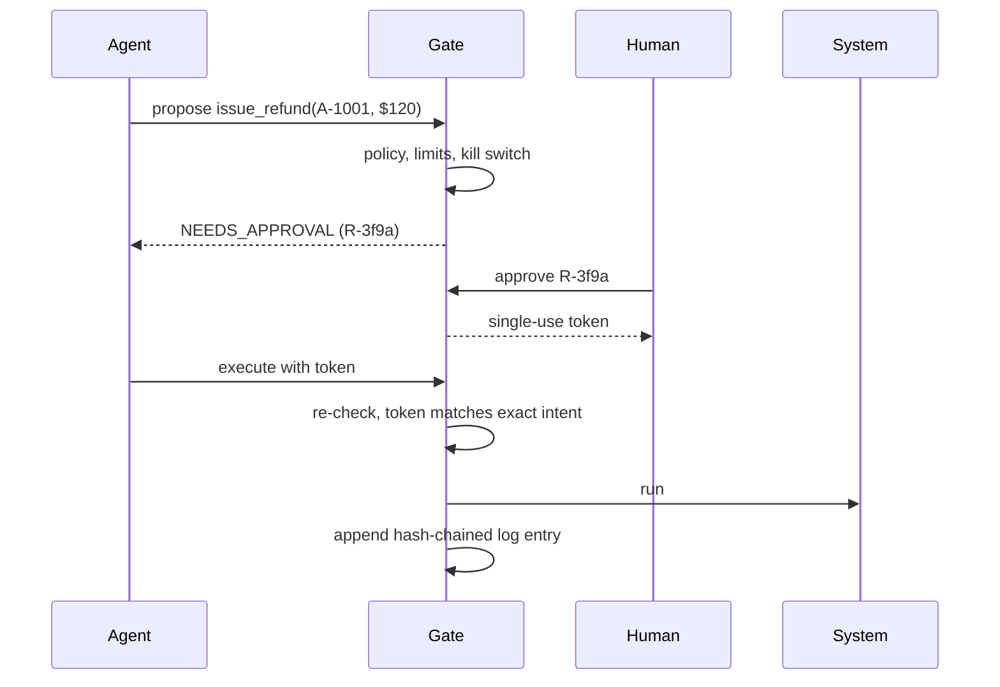

# Agent Action Gate

A small, fail-closed control layer that sits between an AI agent and the real world. Every action an agent proposes is checked against a policy **before** it runs: low-risk actions pass, risky ones wait for a named human, and anything unknown or over limit is refused. Every decision lands in a tamper-evident audit log.

Built after watching an autonomous agent take a money-moving action it should have stopped and asked about. The lesson: don't trust the next agent more, put the controls outside the agent.

## What it enforces

| Control | Behavior |
|---|---|
| **Default deny** | An action not named in the policy is refused. |
| **Risk tiers** | `allow` (look up, draft), `approve` (send, refund, publish), `deny` (delete records). |
| **Limits** | Per-action amount caps, daily spend limits, recipient domain allowlists. |
| **Human approval** | A named approver gets a single-use token bound to the exact action. If the agent changes any parameter after approval (for example, $20 becomes $199), the token is rejected. Approvals expire after 15 minutes. |
| **Re-check at execution** | Limits and the kill switch are checked again right before the action runs, not just when it was proposed. |
| **Kill switch** | One file blocks every agent action, approved or not. `python -m gate kill on` |
| **Audit log** | Append-only JSONL where each entry carries the hash of the one before it. Editing or deleting any line breaks the chain. `python -m gate verify-log` |



## Run it

```bash
python -m unittest discover -s tests -t .   # 14 tests, no dependencies
python -m gate check intent.example.json           # evaluate a proposed action
python -m gate verify-log                   # detect tampering
```

`examples/claude_support_agent.py` wires the gate into a **Claude** support agent built with the Anthropic SDK tool runner. Claude can look up orders on its own; refunds and emails are queued for approval; out-of-policy requests come back with the reason so Claude explains instead of retrying. It needs `pip install anthropic` and an API key.

## Tests cover

Default deny · never-allowed actions · domain allowlist · amount and type validation · single-use tokens · parameter tampering after approval · approval expiry · daily limits based on executed spend · kill switch overriding an approval · log edits and deleted entries both detected.

## Limits

This is a reference implementation: approvals and spend are kept in memory, and the log is a local file. A production version would store them durably, sign approvals, and ship the log to write-once storage.
